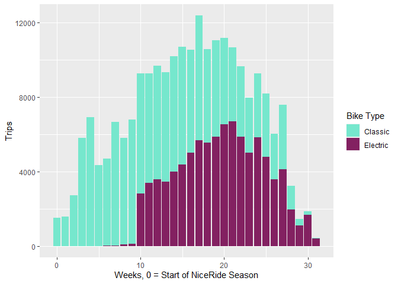
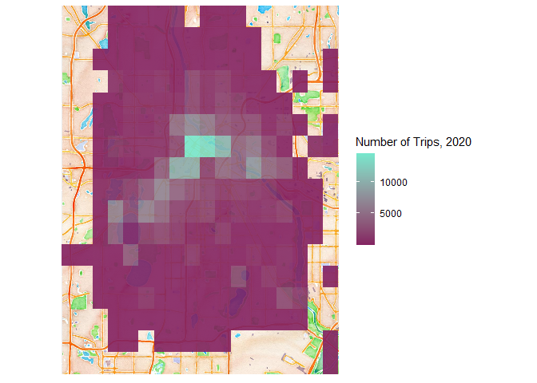
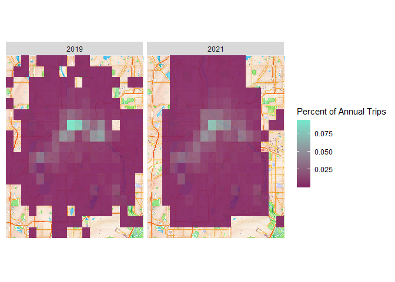
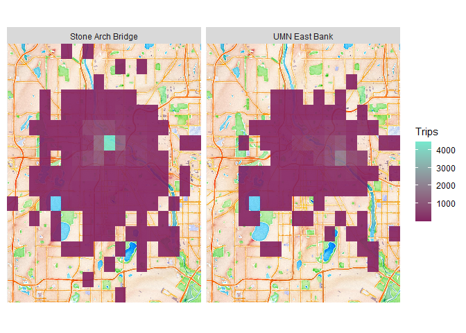
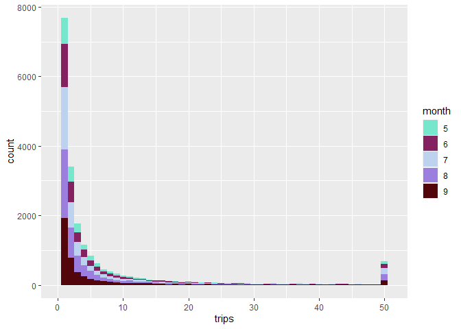

NicerRides: The Geography of EBikeshare in Minneapolis
================

## Background

Electric Bikes (EBikes) have exploded in numbers over the past few
years, especially in [bikeshare
programs](https://www.nytimes.com/2021/03/02/travel/ebikes-bike-sharing-us.html).
EBikes have high upfront costs but are easy to adopt, making them an
ideal candidate for bikeshare, which spreads upfront costs over a large
set of users. The Minneapolis bikeshare program NiceRide, currently
operated by Lyft, began offering EBikes over the course of 2020. As an
EBike true believer,
I’m pretty excited by what this means for cities. Bikeable cities are a
joy to navigate - you get human-scale amenity density, but with a larger
mobility radius than just by foot. And in my experience EBikes solve a
lot of the adoption problems bikes face by just making biking easy. If
you haven’t tried an EBike, I can’t recommend it enough: it’s just so
damn
[pleasant](https://gizmodo.com/riding-an-e-bike-has-changed-my-entire-perspective-on-h-1844575886)!

Conveniently, NiceRide offers thorough
[data](https://www.niceridemn.com/system-data) on trips by their
rideshare bikes. This offers a fairly detailed window into what EBikes
meant to the bikeshare system. At a high level, EBike option was quite
high: the EBike share of rides went from zero to being the clear
majority over the course of 2020:

<!-- -->

[Other research](https://nabsa.net/about/industry/) has discussed the
impact of EBikes on overall ridership in bikeshare systems. But because
the NiceRide data is at the trip level and has detailed location data,
it gives us a chance to look specifically at the geography of bikeshare
in the Twin Cities!

## Bikeshare Geography

As an initial example, here’s a map of where bikeshare rides started in
2020 A quick note: the NiceRide data offers precise coordinates for
docked rides, corresponding to the docks where rides started and
stopped. But to avoid giving overly identifying details for dockless
riders, those ride start/stop locations are rounded to the nearest .01
degrees of longitude and latitude.

<!-- -->

A lot of hopes around EBikes is that they won’t only change the volume
of bikers, but will help spread out the geography of where people ride -
making more parts of the city bikeable. At a high level, we can see some
subtly different patterns looking at the same map for 2019 and 2021, a
sort of “before” and “after” EBikes were part of the NiceRide network.

<!-- -->

Because EBikes were gradually adopted over the course of 2020, the ride
data from that year gives us a chance to more granularly test what
EBikes meant for the geography of bikeshare rides in the Twin Cities. In
particular, I’m going to look at the data through two lenses. First,
I’ll model weekly ride counts between coordinate pairs using Poisson
regression to get a handle on the overall dynamics of ride volume.
Second, I’ll focus narrowly on the weeks surrounding the big
introduction of EBikes to exploit that discontinuity as a natural
experiment.

## Modeling Ride Counts

The NiceRide data is offered at the ride level, so we have details on
every single trip taken that lasts over a minute. Using the rounded
coordinates available for each ride to “group” similar start/finish
spots together, we can count the number of trips between any two
coordinate pairs for any week. For example, here’s a map of where trips
starting in two blocks, the first containing the [Stone Arch
Bridge](https://en.wikipedia.org/wiki/Stone_Arch_Bridge_(Minneapolis))
and the second containing much of the East Bank of the University of
Minnesota campus, went in 2020:

<!-- -->

We can look at each of these “start-end” pairs as a single trip
category, in order to ask the question “where do people bike in
Minneapolis?” Filtering out pairs without rides for the moment, the
counts of these pairs has a strongly right-skewed distribution (values
at 50 include top-capped records):

<!-- -->

We can model these trip counts using Negative Binomial regression, a
subset of Poisson regression. Poisson regression assumes that each value
of the response variable is generated from a process following a Poisson
distribution, which assumes events happening at a constant rate.
Essentially, Poisson regression tries to maximize the likelihood of
modeled rates, where likelihood is based on the probability we’d observe
the count values provided in Poisson distributions with the predicted
rates. More precisely, it estimates the expected log of this rate.
Negative Binomial regression generalizes this by letting the variance of
the rate not be equal to the rate itself.

The dataset I evaluate below includes a variety of variables. The first
category are demographic: using 2010 Census blocks, I include total
population in a block, along with descriptive proportions: the percent
aged under 18, 18-39, 40-64, and 65+; the percent white, percent black,
percent asian, and percent hispanic; the number of households, the
percent of households that are owner occupied and the percent that are
renter occupied. The second category is economic: I include the count of
employees in a block from Census Workplace Area Characterstics data,
along with the percent of those employees in retail. The third category
is climatic: I include the mean maximum temperate and total precipation
for the week in question. The fourth category is geographic: I include
the distance between the two blocks, and a dummy variable for whether
the block borders Minnehaha Falls (models without this dummy
substantially underestimated rides near the falls!). The fifth category
is bike-related: I include the number of bikeshare docking stations in
the block in 2019, the average trip time between the two blocks in 2019,
the volume of rides in the matching week in 2019 (a control on ‘bike
season’) and the percent of rides that were on electric bikes in the
week in question. The dataset is restricted to blocks with &gt; 25 trip
pairs in 2019 and does not include round trips, but does include weeks
with zero trips between a pair in 2020. It is evaluated at the weekly
level throughout 2020.

    ##      trips              week         start_pop    start_pct_white  
    ##  Min.   :  0.000   Min.   : 0.00   Min.   :   2   Min.   :0.07748  
    ##  1st Qu.:  0.000   1st Qu.: 7.75   1st Qu.:1788   1st Qu.:0.53619  
    ##  Median :  1.000   Median :15.50   Median :2725   Median :0.69087  
    ##  Mean   :  4.038   Mean   :15.50   Mean   :3083   Mean   :0.64051  
    ##  3rd Qu.:  4.000   3rd Qu.:23.25   3rd Qu.:4310   3rd Qu.:0.84417  
    ##  Max.   :970.000   Max.   :31.00   Max.   :7619   Max.   :0.94372  
    ##  start_pct_black   start_pct_hispanic start_pct_asian   start_pct_under_18
    ##  Min.   :0.00000   Min.   :0.00000    Min.   :0.00000   Min.   :0.00000   
    ##  1st Qu.:0.03516   1st Qu.:0.03252    1st Qu.:0.02955   1st Qu.:0.05689   
    ##  Median :0.11944   Median :0.04250    Median :0.04418   Median :0.09420   
    ##  Mean   :0.16617   Mean   :0.07940    Mean   :0.06395   Mean   :0.12879   
    ##  3rd Qu.:0.25301   3rd Qu.:0.07708    3rd Qu.:0.09326   3rd Qu.:0.19247   
    ##  Max.   :0.65328   Max.   :0.51242    Max.   :0.31034   Max.   :0.40200   
    ##  start_pct_18_39   start_pct_40_64  start_pct_over_65    start_hh   
    ##  Min.   :0.09957   Min.   :0.0000   Min.   :0.00000   Min.   :   1  
    ##  1st Qu.:0.43759   1st Qu.:0.2212   1st Qu.:0.04415   1st Qu.: 745  
    ##  Median :0.50915   Median :0.2611   Median :0.06388   Median :1175  
    ##  Mean   :0.53948   Mean   :0.2562   Mean   :0.07552   Mean   :1482  
    ##  3rd Qu.:0.63186   3rd Qu.:0.3044   3rd Qu.:0.10764   3rd Qu.:1826  
    ##  Max.   :1.00000   Max.   :0.5397   Max.   :0.35901   Max.   :5625  
    ##  start_pct_renter  start_pct_homeowner start_employees  start_pct_retail 
    ##  Min.   :0.03571   Min.   :0.0000      Min.   :    36   Min.   :0.00000  
    ##  1st Qu.:0.56863   1st Qu.:0.1721      1st Qu.:  8362   1st Qu.:0.08386  
    ##  Median :0.71936   Median :0.2806      Median : 15145   Median :0.13019  
    ##  Mean   :0.67045   Mean   :0.3296      Mean   : 58352   Mean   :0.17868  
    ##  3rd Qu.:0.82791   3rd Qu.:0.4314      3rd Qu.: 52857   3rd Qu.:0.26760  
    ##  Max.   :1.00000   Max.   :0.9643      Max.   :679710   Max.   :0.75138  
    ##  mean_max_temp       precip          distance       start_minnehaha  
    ##  Min.   :33.43   Min.   :0.0000   Min.   :0.00000   Min.   :0.00000  
    ##  1st Qu.:64.50   1st Qu.:0.1500   1st Qu.:0.01414   1st Qu.:0.00000  
    ##  Median :72.36   Median :0.6800   Median :0.02236   Median :0.00000  
    ##  Mean   :70.27   Mean   :0.7738   Mean   :0.02683   Mean   :0.02919  
    ##  3rd Qu.:81.32   3rd Qu.:0.9850   3rd Qu.:0.03606   3rd Qu.:0.00000  
    ##  Max.   :89.00   Max.   :3.3100   Max.   :0.10440   Max.   :1.00000  
    ##  average_time_2019  volume_week_2019 start_docks_19   end_docks_19  
    ##  Min.   :   371.6   Min.   :  516    Min.   :0.000   Min.   :0.000  
    ##  1st Qu.:  1299.1   1st Qu.: 7381    1st Qu.:1.000   1st Qu.:1.000  
    ##  Median :  1938.2   Median :11875    Median :2.000   Median :2.000  
    ##  Mean   :  4278.1   Mean   :11210    Mean   :3.061   Mean   :2.961  
    ##  3rd Qu.:  3645.4   3rd Qu.:15164    3rd Qu.:4.000   3rd Qu.:4.000  
    ##  Max.   :109171.9   Max.   :19876    Max.   :9.000   Max.   :9.000  
    ##  ebikes_available
    ##  Mode :logical   
    ##  FALSE:14730     
    ##  TRUE :32406     
    ##                  
    ##                  
    ## 

Using this dataset, I estimated a Zero-Inflated Negative Binomial model
with a subset the above variables. A few features turned up during this
modeling process: notably, the Minnehaha proximity mattered most when
used in conjunction with distance and log population was a more useful
predictor than raw population. The variables selected for the final
model were picked to avoid interpretative issues resulting from
multicollinearity; including multiple demographic variables from the
same bucket is particularly tricky for this. I’ve tried to select the
most salient subset of each. The critical values for evaluation are the
interaction terms between ebikes\_available and other demographic
variables. When these are positive, that indicates that electric bikes
correlated with increased ridership between blocks with these
demographics; negative indicates the opposite.

    ## 
    ## Call:
    ## zeroinfl(formula = trips ~ volume_week_2019 + start_log_pop + end_log_pop + 
    ##     pct_electric * (start_pct_black + start_pct_renter + start_pct_retail + 
    ##         start_pct_18_39 + end_pct_black + end_pct_renter + end_pct_retail + 
    ##         end_pct_18_39 + mean_max_temp + precip + start_docks_19 + end_docks_19 + 
    ##         distance) + distance:start_minnehaha + distance:end_minnehaha | 
    ##     volume_week_2019 + distance + start_log_pop + end_log_pop, data = reg_in, 
    ##     dist = "negbin")
    ## 
    ## Pearson residuals:
    ##     Min      1Q  Median      3Q     Max 
    ## -1.0381 -0.6727 -0.3862  0.3175 28.4468 
    ## 
    ## Count model coefficients (negbin with log link):
    ##                                 Estimate Std. Error z value Pr(>|z|)    
    ## (Intercept)                   -3.545e+00  1.195e-01 -29.671  < 2e-16 ***
    ## volume_week_2019               7.189e-06        NaN     NaN      NaN    
    ## start_log_pop                  1.045e-01  7.485e-03  13.964  < 2e-16 ***
    ## end_log_pop                    1.309e-01  7.753e-03  16.879  < 2e-16 ***
    ## pct_electric                  -1.079e+00  2.063e-01  -5.230 1.69e-07 ***
    ## start_pct_black               -1.783e+00  1.232e-01 -14.472  < 2e-16 ***
    ## start_pct_renter              -2.355e-01  9.478e-02  -2.485 0.012964 *  
    ## start_pct_retail               4.174e-01  8.793e-02   4.747 2.07e-06 ***
    ## start_pct_18_39               -3.923e-02  1.133e-01  -0.346 0.729181    
    ## end_pct_black                 -1.685e+00  1.238e-01 -13.607  < 2e-16 ***
    ## end_pct_renter                -3.398e-01  9.457e-02  -3.593 0.000327 ***
    ## end_pct_retail                 3.180e-01  8.642e-02   3.680 0.000233 ***
    ## end_pct_18_39                  2.304e-01  1.138e-01   2.024 0.042966 *  
    ## mean_max_temp                  3.545e-02  1.015e-03  34.926  < 2e-16 ***
    ## precip                        -2.613e-02  1.360e-02  -1.922 0.054657 .  
    ## start_docks_19                 2.163e-01  5.514e-03  39.224  < 2e-16 ***
    ## end_docks_19                   2.143e-01  5.582e-03  38.390  < 2e-16 ***
    ## distance                      -4.908e+01  8.864e-01 -55.370  < 2e-16 ***
    ## pct_electric:start_pct_black   1.361e+00  2.620e-01   5.195 2.05e-07 ***
    ## pct_electric:start_pct_renter  2.957e-01  2.027e-01   1.459 0.144649    
    ## pct_electric:start_pct_retail  3.729e-01  1.865e-01   1.999 0.045609 *  
    ## pct_electric:start_pct_18_39   1.442e+00  2.446e-01   5.896 3.72e-09 ***
    ## pct_electric:end_pct_black     1.160e+00  2.646e-01   4.383 1.17e-05 ***
    ## pct_electric:end_pct_renter    4.741e-01  2.028e-01   2.338 0.019374 *  
    ## pct_electric:end_pct_retail    5.337e-01  1.841e-01   2.898 0.003752 ** 
    ## pct_electric:end_pct_18_39     1.195e+00  2.459e-01   4.862 1.16e-06 ***
    ## pct_electric:mean_max_temp    -2.658e-03  2.024e-03  -1.313 0.189128    
    ## pct_electric:precip           -2.035e-02  3.597e-02  -0.566 0.571581    
    ## pct_electric:start_docks_19   -3.518e-02  1.183e-02  -2.974 0.002935 ** 
    ## pct_electric:end_docks_19     -3.647e-02  1.198e-02  -3.045 0.002325 ** 
    ## pct_electric:distance         -2.149e+00  1.930e+00  -1.113 0.265657    
    ## distance:start_minnehaha       5.994e+00  1.197e+00   5.008 5.50e-07 ***
    ## distance:end_minnehaha         3.346e+00  1.084e+00   3.085 0.002035 ** 
    ## Log(theta)                     1.517e-01  6.731e-03  22.535  < 2e-16 ***
    ## 
    ## Zero-inflation model coefficients (binomial with logit link):
    ##                    Estimate Std. Error z value Pr(>|z|)    
    ## (Intercept)       3.018e+00  7.527e-01   4.010 6.07e-05 ***
    ## volume_week_2019 -2.041e-03  6.654e-05 -30.674  < 2e-16 ***
    ## distance          5.601e+01  5.369e+00  10.432  < 2e-16 ***
    ## start_log_pop    -1.823e-01  6.770e-02  -2.692   0.0071 ** 
    ## end_log_pop      -1.175e-01  6.615e-02  -1.775   0.0758 .  
    ## ---
    ## Signif. codes:  0 '***' 0.001 '**' 0.01 '*' 0.05 '.' 0.1 ' ' 1 
    ## 
    ## Theta = 1.1638 
    ## Number of iterations in BFGS optimization: 71 
    ## Log-likelihood: -7.796e+04 on 39 Df

Is this a good model? I have a few reasons to think so. A Chi-Squared
test on residual deviance clearly rejects the null hypothesis; after
adding in the zero-inflation step, the model has a dispersion parameter
of 1.17, indicating it is not critically overdispersed; the model is
preferred to alternate specifications by both AIC and Vuong’s criteria.
I’m certain it doesn’t capture all there is to see here, but a
predicted-actual plot doesn’t suggest an obvious bias.

The results give us some useful information about how EBike availability
impacted where bikeshare rides happened in Minneapolis! In particular,
four significant relationships stand out as correlates with the
availability of EBikes. First, increased ridership in blocks with higher
Black shares of the population; second, increased ridership in blocks
with residents aged 18-39; third, decreased (or less increased)
ridership in blocks which previously had rideshare docks; and finally,
less increased ridership on hotter days. The final one, along with the
low-salience relationship between EBike availability and trip distance,
stand out as surprises: my expectation was that EBikes would be more
pleasant in hotter weather and for longer trips. That may still be true,
but this model doesn’t support that conclusion! It does suggest that
EBikes, likely by virtue of being dockless, expand the range of
bikeshare beyond areas where bike docks were located; and further, that
they may increase ridership in areas with young or Black riders. The
first of these may speak to younger riders being quicker to adopt new
technology - an alternate model suggested EBike availability had a
smaller than typical impact with older riders, although that term is not
in this model due to multicollinearity with the age 18-39 variable. The
second suggests the potential for EBikes to help make bikeshare programs
more inclusive within the city - note the prior negative correlation
between blocks with high Black population and rides.

I’m still working to build this out and make it more rigorous, so I’ll
hopefully have more to say in the future - but I wanted to publish what
I have in the meantime!
